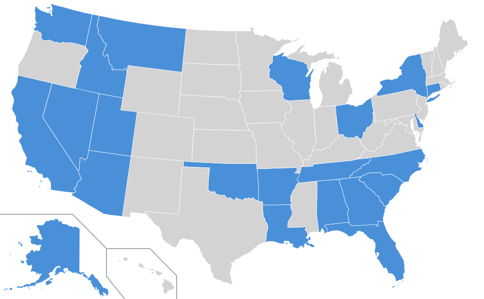

# Classic Traffic


Bluesky bots that post videos of traffic camera timelapses.



## Bots

### Ohio - [@classictraffic.bsky.social](https://bsky.app/profile/classictraffic.bsky.social)
Each video consists of 150-900 images downloaded from a single randomly chosen traffic camera every 6 seconds at 10 fps, so 15-90 minutes worth of images compressed into 15-90 seconds. Cameras sourced from the [OHGO](https://ohgo.com/) road-markers API.

### Montana - [@montanatrafficcams.bsky.social](https://bsky.app/profile/montanatrafficcams.bsky.social)
24-hour timelapses from Montana DOT cameras. Images captured every 15 minutes, played back at 5 fps. Cameras sourced from [Montana MDT](https://www.mdt.mt.gov/).

### Nevada - [@nevadatrafficcams.bsky.social](https://bsky.app/profile/nevadatrafficcams.bsky.social)
Live video clips (30 seconds to 3 minutes) captured directly from HLS streams. Randomly selects a page of 10 cameras from the 645+ available, then picks one. Cameras sourced from [NVRoads](https://www.nvroads.com/).

### Florida - [@floridatrafficcams.bsky.social](https://bsky.app/profile/floridatrafficcams.bsky.social)
Live video clips (30 seconds to 3 minutes) captured from DIVAS-authenticated HLS streams. Randomly selects from 4500+ cameras. Cameras sourced from [FL511](https://fl511.com/).

### Wisconsin - [@wisconsintrafficcams.bsky.social](https://bsky.app/profile/wisconsintrafficcams.bsky.social)
Live video clips (30 seconds to 3 minutes) captured directly from HLS streams. Randomly selects from 480+ cameras. Cameras sourced from [511WI](https://511wi.gov/).

### Utah - [@utahtrafficcams.bsky.social](https://bsky.app/profile/utahtrafficcams.bsky.social)
Image timelapses from 2000+ Utah DOT cameras. Images captured every 2 minutes, played back at 10 fps. Cameras sourced from [Utah 511](https://prod-ut.ibi511.com/).

### New York - [@newyorktrafficcams.bsky.social](https://bsky.app/profile/newyorktrafficcams.bsky.social)
Live video clips (30 seconds to 3 minutes) captured directly from HLS streams. Randomly selects from 3000+ cameras. Cameras sourced from [511NY](https://511ny.org/).

### Delaware - [@delawaretrafficcams.bsky.social](https://bsky.app/profile/delawaretrafficcams.bsky.social)
Live video clips (30 seconds to 3 minutes) captured directly from HLS streams. Randomly selects from 330+ cameras. Cameras sourced from [DelDOT](https://deldot.gov/).

### Alabama - [@alabamatrafficcams.bsky.social](https://bsky.app/profile/alabamatrafficcams.bsky.social)
Image timelapses from ALDOT cameras. Images captured every 30 seconds, played back at 10 fps. Cameras sourced from [ALDOT](https://algotraffic.com/).

### Connecticut - [@connecticuttrafficcams.bsky.social](https://bsky.app/profile/connecticuttrafficcams.bsky.social)
Image timelapses from Connecticut DOT cameras. Images captured every 8 seconds, played back at 10 fps. Cameras sourced from [CTRoads](https://ctroads.org/).

### Idaho - [@idahotrafficcams.bsky.social](https://bsky.app/profile/idahotrafficcams.bsky.social)
Image timelapses from Idaho DOT cameras. Images captured every minute, played back at 10 fps. Cameras sourced from [511 Idaho](https://511.idaho.gov/).

### Georgia - [@georgiatrafficcams.bsky.social](https://bsky.app/profile/georgiatrafficcams.bsky.social)
Live video clips (30 seconds to 3 minutes) captured from DIVAS-authenticated HLS streams. Randomly selects from 3800+ cameras. Cameras sourced from [511GA](https://511ga.org/).

### South Carolina - [@southcarolinatraffic.bsky.social](https://bsky.app/profile/southcarolinatraffic.bsky.social)
Live video clips (30 seconds to 3 minutes) captured directly from HLS streams. Randomly selects from 730+ cameras. Cameras sourced from [511SC](https://www.511sc.org/).

### North Carolina - [@northcarolinatraffic.bsky.social](https://bsky.app/profile/northcarolinatraffic.bsky.social)
Live video clips (30 seconds to 3 minutes) captured directly from HLS streams. Randomly selects from 1100+ cameras. Cameras sourced from [NCDOT](https://nc.prod.traveliq.co/).

### Tennessee - [@tennesseetrafficcams.bsky.social](https://bsky.app/profile/tennesseetrafficcams.bsky.social)
Live video clips (30 seconds to 3 minutes) captured directly from HLS streams. Randomly selects from 660+ cameras. Cameras sourced from [SmartWay](https://smartway.tn.gov/).

### Arkansas - [@arkansastrafficcams.bsky.social](https://bsky.app/profile/arkansastrafficcams.bsky.social)
Live video clips (30 seconds to 3 minutes) captured from token-authenticated HLS streams. Randomly selects from 540+ cameras. Cameras sourced from [IDriveArkansas](https://www.idrivearkansas.com/).

### Arizona - [@arizonatrafficcams.bsky.social](https://bsky.app/profile/arizonatrafficcams.bsky.social)
Image timelapses from ADOT cameras. Images captured every 60 seconds, played back at 10 fps. Cameras sourced from [AZ511](https://www.az511.gov/).

### Oklahoma - [@oklahomatrafficcams.bsky.social](https://bsky.app/profile/oklahomatrafficcams.bsky.social)
Live video clips (30 seconds to 3 minutes) captured directly from HLS streams. Randomly selects from 390+ cameras. Cameras sourced from [OKTraffic](https://oktraffic.org/).

### Alaska - [@alaskatrafficcams.bsky.social](https://bsky.app/profile/alaskatrafficcams.bsky.social)
Image timelapses from Alaska DOT cameras. Images captured every 60 seconds, played back at 10 fps. Cameras sourced from [511 Alaska](https://511.alaska.gov/).

### California - [@californiatrafficcams.bsky.social](https://bsky.app/profile/californiatrafficcams.bsky.social)
Randomly selects one of 12 Caltrans districts, then picks a camera. Cameras with HLS streams get live video clips (30 seconds to 6 minutes); image-only cameras get timelapses captured every 6 seconds at 10 fps. Cameras sourced from [Caltrans](https://cwwp2.dot.ca.gov/).

### Washington - [@washingtontrafficcams.bsky.social](https://bsky.app/profile/washingtontrafficcams.bsky.social)
Image timelapses from 1600+ WSDOT cameras. Images captured every 2 minutes, played back at 10 fps. Cameras sourced from [WSDOT](https://wsdot.com/travel/real-time/cameras).

### Louisiana - [@louisianatrafficcams.bsky.social](https://bsky.app/profile/louisianatrafficcams.bsky.social)
Live video clips (1 to 6 minutes) captured directly from HLS streams, with image timelapse fallback. Randomly selects from 320+ cameras. Cameras sourced from [511LA](https://www.511la.org/).

### Colorado - [@coloradotrafficcams.bsky.social](https://bsky.app/profile/coloradotrafficcams.bsky.social)
Live video clips (1 to 6 minutes) from 800+ HLS streams, with image timelapse fallback for 200+ snapshot-only cameras. Cameras sourced from [COtrip](https://www.cotrip.org/).

### Kansas - [@kansastrafficcams.bsky.social](https://bsky.app/profile/kansastrafficcams.bsky.social)
Image timelapses from 360+ KanDrive cameras. Images captured every 6 seconds, played back at 10 fps. Cameras sourced from [KanDrive](https://www.kandrive.gov/).

### Iowa - [@iowatrafficcams.bsky.social](https://bsky.app/profile/iowatrafficcams.bsky.social)
Live video clips (1 to 6 minutes) from 620+ HLS streams, with image timelapse fallback for 540+ snapshot-only cameras. Randomly selects from 1170+ cameras. Cameras sourced from [511 Iowa](https://511ia.org/).

## Installation
Create a `keys.js` file with your Bluesky credentials:

```js
module.exports = {
    // Shared Bluesky service URLs
    service: 'https://bsky.social',
    videoService: 'https://video.bsky.app',

    // Account credentials (one entry per state bot)
    accounts: {
        ohio: {
            identifier: '...',
            password: '...',
        },
        // ... add an entry for each state
    },
};
```

Then, install dependencies:

`npm ci`

## Run

```
node states/<state>.js
# or
npm run <state>
```

For example:
```
npm run ohio
npm run tennessee
```

### Options
| Flag | Description |
|------|-------------|
| `--list` | List available cameras and exit (no login required) |
| `--dry-run` | Do everything except post to Bluesky |
| `--persist` | Keep the assets folder (downloaded images and video) |
| `--id <id>` | Use a specific camera instead of random |

## Project Structure

```
states/              # State-specific bot implementations (one file per state)
TrafficBot.js        # Base class with shared workflow
keys.js              # Bluesky credentials (gitignored)
assets/              # Temporary download directory (gitignored)
map.svg              # US map highlighting active states
```

## Architecture

The project uses a class-based architecture with `TrafficBot` as the base class. There are two patterns:

**Image timelapse bots** (Ohio, Montana, Utah, Alabama, Connecticut, Idaho, Arizona, Alaska, Washington, Kansas) extend `TrafficBot` and use the standard workflow: download images over time, deduplicate, stitch into video with ffmpeg, and post.

**Live video clip bots** (Nevada, Florida, Wisconsin, New York, Delaware, Georgia, South Carolina, North Carolina, Tennessee, Arkansas, Oklahoma, Louisiana) override `run()` to skip the image loop entirely. They capture a segment of a live HLS video stream directly with ffmpeg. Florida and Georgia add DIVAS authentication, and Arkansas uses a token redirect for stream access.

**Hybrid bots** (California, Colorado, Iowa) override `run()` to support both modes. If the chosen camera has an HLS stream, it records a live video clip; otherwise, it falls back to image timelapse.

### TrafficBot (base class)

Handles the common workflow:
1. Login to Bluesky
2. Fetch and select a camera (calls subclass `fetchCameras()`)
3. Download images over time (calls subclass `downloadImage()`)
4. Create timelapse video with ffmpeg
5. Upload and post to Bluesky
6. Cleanup temp files

### Constructor Config

| Property | Type | Description |
|----------|------|-------------|
| `accountName` | string | Key in `keys.js` accounts object (e.g., `'ohio'`) |
| `timezone` | string | IANA timezone for timestamps (e.g., `'America/New_York'`) |
| `tzAbbrev` | string | Timezone abbreviation for display (e.g., `'ET'`) |
| `framerate` | number | Video playback fps |
| `delayBetweenImageFetches` | number | Milliseconds between downloads |
| `is24HourTimelapse` | boolean | If true, shows "24-Hour Timelapse:" in post |

### Required Methods (image timelapse bots)

| Method | Returns | Description |
|--------|---------|-------------|
| `fetchCameras()` | `Promise<Camera[]>` | Fetch available cameras from data source |
| `downloadImage(index)` | `Promise<boolean>` | Download image at index, return true if unique |
| `getNumImages()` | `number` | Number of images to capture |

### Optional Methods

| Method | Returns | Description |
|--------|---------|-------------|
| `shouldAbort()` | `boolean` | Return true to skip video/post (e.g., frozen camera) |

### Helper Methods

| Method | Description |
|--------|-------------|
| `this.getImagePath(index)` | Get file path for image |
| `this.checkAndStoreImage(path, index)` | Dedupe check, deletes duplicates, updates count |
| `this.sleep(ms)` | Async sleep |

### Camera Object

```js
{
  id: string,        // Unique identifier
  name: string,      // Display name
  url: string,       // Image or video stream URL
  latitude: number,  // GPS lat (0 if unknown)
  longitude: number  // GPS long (0 if unknown)
}
```

## Adding a New Bot

1. Add credentials to `keys.js`

2. Create a new file in `states/` that extends `TrafficBot`. See existing bots for examples:
   - **Image timelapse**: Use `states/ohio.js` as a template. Implement `fetchCameras()`, `downloadImage()`, and `getNumImages()`.
   - **Live video clip**: Use `states/nevada.js` as a template. Override `run()` and add a `downloadVideoSegment()` method.
   - **Live video clip with auth**: Use `states/florida.js` as a template if the HLS streams require token authentication.

3. Add an npm script to `package.json`:
```json
"scripts": {
    "newstate": "node states/newstate.js"
}
```

## Credits

US map SVG adapted from a [GitHub Gist by coryetzkorn](https://gist.github.com/coryetzkorn/3077873), originally sourced from [Wikipedia](https://en.wikipedia.org/wiki/File:Blank_US_Map_(states_only).svg) (public domain).
