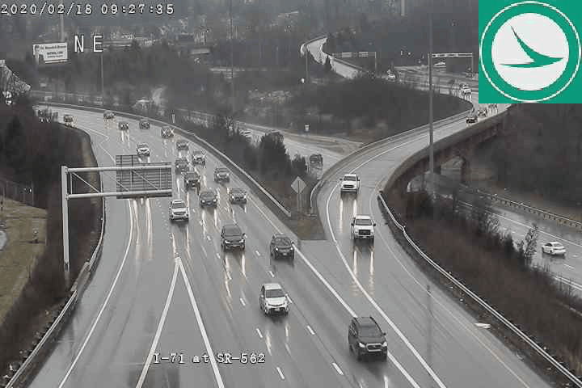

# Classic Traffic



Bluesky bots that post traffic camera videos for every U.S. state. Each bot runs on a 30-minute cron and posts a timelapse or live video clip from a randomly chosen camera.

## How It Works

There are two core bot types, plus hybrids that support both:

**Image timelapse bots** download a series of snapshots from a DOT camera API at a fixed interval, deduplicate them by hash (to detect frozen cameras), stitch them into an MP4 with ffmpeg, and post to Bluesky. The resulting video is sped up to target a ~30-second output.

**Live video clip bots** capture a segment of a live HLS stream directly with ffmpeg, then re-encode it at a dynamic speed (2–16×) to target a ~30-second output. Some states require authentication: Florida, Georgia, and Pennsylvania use DIVAS token exchange; Arkansas and Massachusetts use token-redirect auth.

**Video speed** is calculated dynamically: `speed = clamp(captureDuration / 30s, 2×, 16×)`. A 60-second clip encodes at 2× (30s output); a 480-second clip encodes at 16× (30s output). The speed is shown in every post (e.g., `4x speed`).

Each bot tracks the last 48 chosen cameras and prefers cameras it hasn't used recently. Posts include the camera name or a reverse-geocoded location, timestamp, speed, and weather (temperature and conditions at start and end of the capture window, via Open-Meteo).

## Bots

### Image Timelapses

| State | Account | Cameras | Interval | fps | Source |
|-------|---------|---------|----------|-----|--------|
| Ohio | [@classictraffic.bsky.social](https://bsky.app/profile/classictraffic.bsky.social) | 2000+ | 6s | 10 | [OHGO](https://ohgo.com/) |
| Montana | [@montanatrafficcams.bsky.social](https://bsky.app/profile/montanatrafficcams.bsky.social) | 400+ | 15 min | 5 | [Montana MDT](https://www.mdt.mt.gov/) |
| Utah | [@utahtrafficcams.bsky.social](https://bsky.app/profile/utahtrafficcams.bsky.social) | 2000+ | 2 min | 10 | [Utah 511](https://prod-ut.ibi511.com/) |
| Alabama | [@alabamatrafficcams.bsky.social](https://bsky.app/profile/alabamatrafficcams.bsky.social) | 640+ | 15 min | 5 | [AlgoTraffic](https://algotraffic.com/) |
| Connecticut | [@connecticuttrafficcams.bsky.social](https://bsky.app/profile/connecticuttrafficcams.bsky.social) | 400+ | 8s | 10 | [CTRoads](https://ctroads.org/) |
| Idaho | [@idahotrafficcams.bsky.social](https://bsky.app/profile/idahotrafficcams.bsky.social) | 300+ | 60s | 5 | [511 Idaho](https://511.idaho.gov/) |
| Arizona | [@arizonatrafficcams.bsky.social](https://bsky.app/profile/arizonatrafficcams.bsky.social) | 500+ | 60s | 10 | [AZ511](https://www.az511.gov/) |
| Alaska | [@alaskatrafficcams.bsky.social](https://bsky.app/profile/alaskatrafficcams.bsky.social) | 300+ | 60s | 10 | [511 Alaska](https://511.alaska.gov/) |
| Washington | [@washingtontrafficcams.bsky.social](https://bsky.app/profile/washingtontrafficcams.bsky.social) | 1600+ | 2 min | 10 | [WSDOT](https://wsdot.com/travel/real-time/cameras) |
| Kansas | [@kansastrafficcams.bsky.social](https://bsky.app/profile/kansastrafficcams.bsky.social) | 360+ | 6s | 10 | [KanDrive](https://www.kandrive.gov/) |
| New Hampshire | [@newhampshiretraffic.bsky.social](https://bsky.app/profile/newhampshiretraffic.bsky.social) | 100+ | 2 min | 5 | [New England 511](https://newengland511.org/) |
| Maine | [@mainetrafficcams.bsky.social](https://bsky.app/profile/mainetrafficcams.bsky.social) | 100+ | 2 min | 5 | [New England 511](https://newengland511.org/) |
| Vermont | [@vermonttrafficcams.bsky.social](https://bsky.app/profile/vermonttrafficcams.bsky.social) | 100+ | 2 min | 5 | [New England 511](https://newengland511.org/) |
| South Dakota | [@southdakotatraffic.bsky.social](https://bsky.app/profile/southdakotatraffic.bsky.social) | 570+ | 10 min | 5 | [SD511](https://www.sd511.org/) |
| North Dakota | [@ndtrafficcams.bsky.social](https://bsky.app/profile/ndtrafficcams.bsky.social) | 570+ | 15 min | 5 | [ND Travel](https://travel.dot.nd.gov/) |
| Nebraska | [@nebraskatrafficcams.bsky.social](https://bsky.app/profile/nebraskatrafficcams.bsky.social) | 1080+ | 5 min | 5 | [Nebraska 511](https://www.511.nebraska.gov/) |
| Michigan | [@michigantrafficcams.bsky.social](https://bsky.app/profile/michigantrafficcams.bsky.social) | 750+ | 6s | 10 | [MiDrive](https://mdotjboss.state.mi.us/MiDrive/cameras) |
| Oregon | [@oregontrafficcams.bsky.social](https://bsky.app/profile/oregontrafficcams.bsky.social) | 1100+ | 5 min | 5 | [TripCheck](https://www.tripcheck.com/) |
| Indiana | [@indianatrafficcams.bsky.social](https://bsky.app/profile/indianatrafficcams.bsky.social) | 730+ | 60s | 5 | [511IN](https://511in.org/) |
| Kentucky | [@kentuckytrafficcams.bsky.social](https://bsky.app/profile/kentuckytrafficcams.bsky.social) | 240+ | 6s | 10 | [KYTC](https://maps.kytc.ky.gov/trafficcameras/) |
| Wyoming | [@wyomingtrafficcams.bsky.social](https://bsky.app/profile/wyomingtrafficcams.bsky.social) | 220+ | 2 min | 5 | [WYOROAD](https://www.wyoroad.info/) |

Montana posts 24-hour timelapses (images captured every 15 minutes over a full day). Ohio has a 25% chance of posting a multi-camera thread instead of a single post.

### Live Video Clips

Clip durations are sampled randomly from 1–8 minutes per run and encoded at 2–16× speed.

| State | Account | Cameras | Auth | Source |
|-------|---------|---------|------|--------|
| Nevada | [@nevadatrafficcams.bsky.social](https://bsky.app/profile/nevadatrafficcams.bsky.social) | 645+ | — | [NVRoads](https://www.nvroads.com/) |
| Florida | [@floridatrafficcams.bsky.social](https://bsky.app/profile/floridatrafficcams.bsky.social) | 4500+ | DIVAS | [FL511](https://fl511.com/) |
| Wisconsin | [@wisconsintrafficcams.bsky.social](https://bsky.app/profile/wisconsintrafficcams.bsky.social) | 480+ | — | [511WI](https://511wi.gov/) |
| New York | [@newyorktrafficcams.bsky.social](https://bsky.app/profile/newyorktrafficcams.bsky.social) | 3000+ | — | [511NY](https://511ny.org/) |
| Delaware | [@delawaretrafficcams.bsky.social](https://bsky.app/profile/delawaretrafficcams.bsky.social) | 330+ | — | [DelDOT](https://deldot.gov/) |
| Georgia | [@georgiatrafficcams.bsky.social](https://bsky.app/profile/georgiatrafficcams.bsky.social) | 3800+ | DIVAS | [511GA](https://511ga.org/) |
| South Carolina | [@southcarolinatraffic.bsky.social](https://bsky.app/profile/southcarolinatraffic.bsky.social) | 730+ | — | [511SC](https://www.511sc.org/) |
| North Carolina | [@northcarolinatraffic.bsky.social](https://bsky.app/profile/northcarolinatraffic.bsky.social) | 1100+ | — | [NCDOT](https://nc.prod.traveliq.co/) |
| Tennessee | [@tennesseetrafficcams.bsky.social](https://bsky.app/profile/tennesseetrafficcams.bsky.social) | 660+ | — | [SmartWay](https://smartway.tn.gov/) |
| Arkansas | [@arkansastrafficcams.bsky.social](https://bsky.app/profile/arkansastrafficcams.bsky.social) | 540+ | Token | [IDriveArkansas](https://www.idrivearkansas.com/) |
| Oklahoma | [@oklahomatrafficcams.bsky.social](https://bsky.app/profile/oklahomatrafficcams.bsky.social) | 390+ | — | [OKTraffic](https://oktraffic.org/) |
| Virginia | [@virginiatrafficcams.bsky.social](https://bsky.app/profile/virginiatrafficcams.bsky.social) | 500+ | — | [VDOT 511](https://511.vdot.virginia.gov/) |
| Mississippi | [@mstrafficcams.bsky.social](https://bsky.app/profile/mstrafficcams.bsky.social) | 390+ | — | [MDOTtraffic](https://www.mdottraffic.com/) |
| Pennsylvania | [@pennsylvaniatraffic.bsky.social](https://bsky.app/profile/pennsylvaniatraffic.bsky.social) | 1430+ | DIVAS | [511PA](https://www.511pa.com/) |
| Massachusetts | [@massachusettstraffic.bsky.social](https://bsky.app/profile/massachusettstraffic.bsky.social) | 290+ | Token | [Mass511](https://mass511.com/) |
| New Jersey | [@newjerseytrafficcams.bsky.social](https://bsky.app/profile/newjerseytrafficcams.bsky.social) | 110+ | — | [511NJ](https://511nj.org/) |
| Maryland | [@marylandtrafficcams.bsky.social](https://bsky.app/profile/marylandtrafficcams.bsky.social) | 550+ | — | [CHART](https://chart.maryland.gov/) |
| Missouri | [@missouritrafficcams.bsky.social](https://bsky.app/profile/missouritrafficcams.bsky.social) | 870+ | — | [MoDOT Traveler](https://traveler.modot.org/) |
| Texas | [@texastrafficcams.bsky.social](https://bsky.app/profile/texastrafficcams.bsky.social) | 3400+ | — | [DriveTexas](https://drivetexas.org/) |
| West Virginia | [@westvirginiatraffic.bsky.social](https://bsky.app/profile/westvirginiatraffic.bsky.social) | 120+ | — | [WV511](https://wv511.org/) |
| New Mexico | [@newmexicotrafficcams.bsky.social](https://bsky.app/profile/newmexicotrafficcams.bsky.social) | 180+ | — | [NMRoads](https://nmroads.com/) |
| Rhode Island | [@rhodeislandtraffic.bsky.social](https://bsky.app/profile/rhodeislandtraffic.bsky.social) | 130+ | — | [RIDOT](https://www.dot.ri.gov/travel/cameras_metro.php) |

**DIVAS auth**: The 511 platform (FL511, 511GA, 511PA) requires a two-step token exchange — a session token from the 511 portal is exchanged with the arcadis-ivds.com API to get an authenticated HLS URL. Georgia and Pennsylvania use the image ID (not the camera ID) for this exchange.

### Hybrid (Video + Image Fallback)

These bots post a live video clip if the chosen camera has an HLS stream, or fall back to an image timelapse otherwise.

| State | Account | Cameras | Source |
|-------|---------|---------|--------|
| California | [@californiatrafficcams.bsky.social](https://bsky.app/profile/californiatrafficcams.bsky.social) | 2000+ across 12 Caltrans districts | [Caltrans](https://cwwp2.dot.ca.gov/) |
| Colorado | [@coloradotrafficcams.bsky.social](https://bsky.app/profile/coloradotrafficcams.bsky.social) | 1000+ (800+ video, 200+ image-only) | [COtrip](https://www.cotrip.org/) |
| Iowa | [@iowatrafficcams.bsky.social](https://bsky.app/profile/iowatrafficcams.bsky.social) | 1170+ (620+ video, 540+ image-only) | [511 Iowa](https://511ia.org/) |
| Hawaii | [@hawaiitrafficcams.bsky.social](https://bsky.app/profile/hawaiitrafficcams.bsky.social) | 310+ (280+ video, 30+ image-only) | [GoAkamai](http://www.goakamai.org/) |
| Minnesota | [@minnesotatrafficcams.bsky.social](https://bsky.app/profile/minnesotatrafficcams.bsky.social) | 1510+ (1230+ video, 270+ image-only) | [511MN](https://511mn.org/) |
| Illinois | [@illinoistrafficcams.bsky.social](https://bsky.app/profile/illinoistrafficcams.bsky.social) | 870+ image cameras + Jane Byrne Interchange live video | [Travel Midwest](https://travelmidwest.com/) |

## Road Trips

Road trip mode posts a Bluesky thread showing live traffic across multiple states along a single interstate — one post per state, each reply linking to the next.

```
./run-road-trip.sh --highway I-75
./run-road-trip.sh --highway I-95 --dry-run
```

The thread is started by a dedicated `roadtrip` Bluesky account, which posts an intro with a generated map image showing the highway's route. Each state bot then replies using its own account, with a post title like `"I-75 through Tennessee 🛣️"` including the clip time range, speed, and weather.

The thread requires at least 2 states to succeed. All states use the same randomly sampled clip duration (1–8 minutes). The bot finds a camera on the target highway by searching camera names first, then falling back to reverse geocoding a sample of cameras. States with slow-refresh image cameras (60s+ intervals) are unlikely to produce enough unique frames within the clip window and are soft-skipped.

**Supported interstates**: I-10, I-20, I-26, I-35, I-40, I-49, I-55, I-59, I-64, I-70, I-75, I-77, I-80, I-81, I-85, I-90, I-94, I-95

## Meta Account

[@classictraffic.bsky.social](https://bsky.app/profile/classictraffic.bsky.social) is the project's umbrella account. It doesn't post original content — it exists to host the fleet-wide [starter pack](https://bsky.app/starter-pack/classictraffic.bsky.social) and surface notable posts from the state bots. Credentials live in `keys.js` under the `meta` key.

### Engagement-Based Reposts

`meta/engagement-repost.js` scans each state bot's recent posts, scores by engagement, and reposts the top N from the meta account. It's idempotent — re-reading the meta account's existing repost records on each run to skip anything already reposted. Each run:

1. Fetches the meta account's existing repost records so posts aren't reposted twice.
2. For each state bot, pulls posts from the last `LOOKBACK_DAYS` (default 3) that are older than `POST_AGE_MIN_HOURS` (default 6, so posts have time to accumulate engagement).
3. Scores each candidate: `likes + 2·reposts + 3·replies`, filtered by `MIN_LIKES` (default 3).
4. Reposts the top `MAX_REPOSTS_PER_RUN` (default 3) from the meta account.

Tune the constants at the top of the file. Suggested cadence: 1–2× per day via cron. Supports `--dry-run`.

### Adding Interstates

```
node fetch-highway-routes.js I-22 I-68 I-82
```

This fetches route geometry from OpenStreetMap, computes total mileage, determines the ordered list of states via Nominatim reverse geocoding, and writes the entry to `highways.json`. Re-run with a highway name to force a refresh.

## Installation

Create a `keys.js` file (gitignored):

```js
module.exports = {
    googleKey: '...',           // Google Maps API key (reverse geocoding)
    service: 'https://bsky.social',
    videoService: 'https://video.bsky.app',
    launchDarklyKey: '...',     // Optional: LaunchDarkly SDK key for per-bot feature flags
    grafana: {                  // Optional: Grafana Loki run telemetry
        lokiUrl: '...',
        user: '...',
        apiKey: '...',
    },
    accounts: {
        ohio: { identifier: '...', password: '...' },
        // one entry per state, plus:
        roadtrip: { identifier: '...', password: '...' },
    },
};
```

Then install dependencies:

```
npm ci
```

## Running

```
node states/<state>.js
# or
npm run <state>
```

| Flag | Description |
|------|-------------|
| `--list` | List available cameras and exit (no login required) |
| `--dry-run` | Capture and encode but skip posting to Bluesky |
| `--persist` | Keep the assets folder after the run |
| `--id <id>` | Force a specific camera instead of random selection |

Bots are normally invoked by `run-bot.sh`, which adds file locking (prevents overlapping runs), Grafana Loki telemetry, LaunchDarkly feature flag checks, and process timeout enforcement.

## Architecture

```
TrafficBot.js             # Base class: image loop, deduplication, video encoding, Bluesky posting
states/                   # One file per state, extends TrafficBot
meta/                     # Scripts for the @classictraffic umbrella account
run-meta.sh               # Cron wrapper for meta/ scripts: locking, timeouts, logging
run-bot.sh                # Cron wrapper: locking, timeouts, feature flags, telemetry
run-road-trip.sh          # Cron wrapper for road trip mode
road-trip.js              # Road trip thread logic
generate-road-trip-map.js # Generates the highway map image for road trip intro posts
fetch-highway-routes.js   # Fetches route GeoJSON from Overpass API, populates highways.json
highways.json             # Interstate definitions (ordered state list, total miles)
highway-routes/           # Cached route GeoJSON per highway (gitignored)
status.js                 # Reports last successful post time per bot
keys.js                   # Credentials (gitignored)
assets/                   # Temporary download directory (gitignored)
cron/                     # Per-bot logs, lock files, recent camera lists (gitignored)
```

### TrafficBot Base Class

Handles the shared workflow for image timelapse bots:

1. Login to Bluesky
2. Fetch and select a camera (prefers cameras not used in the last 48 runs)
3. Download images at a fixed interval, deduplicating by MD5 hash
4. If duplicates are detected, increase the interval by 1.5× (up to 4× the base) and reset on the next unique image; abort if the camera appears frozen
5. Create a timelapse video with ffmpeg
6. Upload and post to Bluesky with location, timestamp, speed factor, and weather
7. Clean up temp files

**Constructor config:**

| Property | Type | Description |
|----------|------|-------------|
| `accountName` | string | Key in `keys.js` accounts (e.g. `'ohio'`) |
| `timezone` | string | IANA timezone for timestamps (e.g. `'America/New_York'`) |
| `tzAbbrev` | string | Timezone abbreviation shown in posts (e.g. `'ET'`) |
| `framerate` | number | Video playback fps |
| `delayBetweenImageFetches` | number | Base milliseconds between image downloads |
| `maxImageCollectionMs` | number | Optional cap on total collection time |
| `targetOutputSeconds` | number | Target output video length in seconds (default: 30) |
| `is24HourTimelapse` | boolean | If true, labels the post as a "24-Hour Timelapse:" |
| `threadProbability` | number | Probability (0–1) of posting a multi-camera thread instead of a single post |

**Methods subclasses implement:**

| Method | Returns | Description |
|--------|---------|-------------|
| `fetchCameras()` | `Promise<Camera[]>` | Fetch available cameras from the state's data source |
| `downloadImage(index)` | `Promise<boolean>` | Download one image; return `true` if unique |
| `getNumImages()` | `number` | How many images to capture per run |
| `shouldAbort()` | `boolean` | Return `true` to skip video and post (e.g. frozen camera). Default: abort after 10 consecutive duplicates |
| `getTimeout()` | `number` | Max runtime in seconds before the process is killed (default: 7200) |

**Helper methods available to subclasses:**

| Method | Description |
|--------|-------------|
| `this.checkAndStoreImage(path, index)` | Validates JPEG, deduplicates by hash, deletes duplicates; returns `true` if unique |
| `this.getImagePath(index)` | Returns the file path for a given image index |
| `this.getSetpts(captureDurationS)` | Computes the ffmpeg `setpts` factor for dynamic speed (2–16×) |
| `this.downloadVideoSegment(duration)` | *(video bots)* Capture and encode an HLS stream segment |
| `this.reverseGeocode(lat, lon)` | Returns a location string via Google Maps Geocoding API |
| `this.fetchWeather(lat, lon)` | Returns `{tempF, description}` via Open-Meteo (no API key needed) |
| `this.sleep(ms)` | Async delay |

**Camera object:**

```js
{
  id: string,        // Unique identifier (source-specific)
  name: string,      // Display name
  url: string,       // Snapshot URL or HLS stream URL
  latitude: number,  // GPS latitude (0 if unknown)
  longitude: number, // GPS longitude (0 if unknown)
  hasVideo?: boolean, // Hybrid bots: true if camera has an HLS stream
  imageId?: string,  // 511 platform bots: image ID used for DIVAS auth (may differ from camera ID)
}
```

## Adding a New Bot

1. Add credentials to `keys.js`
2. Create `states/<state>.js` extending `TrafficBot`:
   - **Image timelapse**: use `states/ohio.js` as a template — implement `fetchCameras()`, `downloadImage()`, and `getNumImages()`
   - **Live video clip**: use `states/nevada.js` as a template — override `run()` and add `downloadVideoSegment()`
   - **Live video with DIVAS auth**: use `states/florida.js` as a template
   - **Hybrid**: use `states/california.js` as a template
3. Add an npm script to `package.json`:
   ```json
   "newstate": "node states/newstate.js"
   ```

## Monitoring

`status.js` reads all `cron/*.log` files and reports when each bot last successfully posted. Bots run every 30 minutes, so any bot without a post in over an hour is flagged as stale.

```
node status.js
```

Example output:

```
Bot post status — 2/20/2026, 3:45:00 PM
Stale threshold: >1 hour without a successful post (bots run every 30 min)

   State           Last posted                            Since
   ─────────────────────────────────────────────────────────────────
[!] connecticut     Thu Feb 20 10:12:44 PST 2026           5h 32m ago
[!] alabama         (no log file)
    ohio            Thu Feb 20 15:41:22 PST 2026           3m ago
    florida         Thu Feb 20 15:40:01 PST 2026           5m ago

2 bot(s) stale, 48 healthy
```
